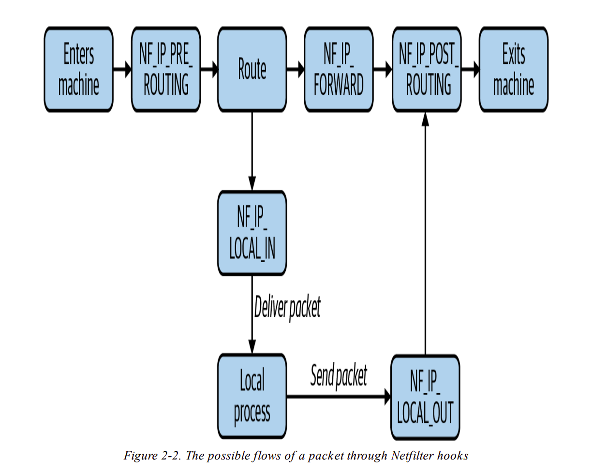
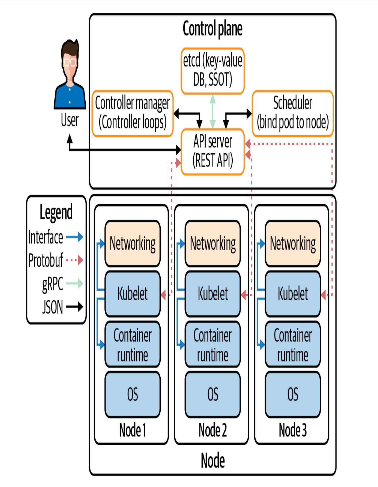

# OSI and TCP models
# Networking in Linux

    This Chapter contains:
    * The Network Interface
    * The Bridge Interface
    * Packet Handeling in karnel
        * netfilter
        * Connreack
        * Routing
    * High Level Routing
        * iptables
        * IPVS
        * eBPF
    * Network Troubleshooting Tools
        * Security Warning
        * ping
        * traceroute
        * dig
        * telnet
        * nmap
        * netstat
        * netcat
        * Openssl
        * cURL

### Netfilter

There are mainly five types of hooks
1. NF_IP_PRE_ROUTING
2. NF_IP_LOCAL_IN
3. NP_IP_FORWARD
4. NF_IP_LOCAL_OUT
5. NF_IP_POST_ROUTING

### iptables
iptables can be used to create firewalls and audit logs, mutate and reroute 
packets, and even implement crude connection fan-out. iptables uses Netfilter. 
Netfilter can intercept (stop) and mutate (change) packets.<br>
iptables components
    
    tables -> chains -> rules

table contains chains, chain contains rules.<br>
There are five types of tables 
1. Filter - for firewall related rules
2. NAT - for NAT related rules
3. Mangle - for non-NAT packet-mutating rules
4. Raw
5. Security

There are mainly five channels one for each Netfilter hook.
1. PREROUTING
2. INPUT
3. NAT
4. OUTPUT
5. POSTROUTING

5. <br>
When a packet passes through the channel a set of rules applied sequentially. 
Until the packet matches a "terminating target" (DROP) or reaches the end of the 
chain. 

### IPVS:
IP Virtual Server is a Linux connection load balancer. IPVS support multiple 
load balancing mode in kubernetes.


You van create load balancers by running:

> $ ipvsadm -A -t <'address'> -s <'mode'>

# 3. Container Networking Basics
    This Chapter contains:
    * Introduction to container
        * Applicaion
        * Hypervisor
        * Containers
    * Container Premitives
        * Control Groups
        * Namespaces
    * Container Network Basics
        * Docker Networking model
        * Overlay Networking
        * Container Network Interface
    * Container Connectivity
        * Container to Container
        * Container to Container Separate Hosts
## Introduction
### Hypervisor
Hypervisor is a way to increase one host machine's efficiency and remove 
the one operating system and networking stack issue. Hypervisor replicate 
hardware resources (CPU, Memory) to create guest operating system or virtual 
machines.<br>
#### Container:
A running container image
#### Image:
A file that creates container
#### Container Engine:
A system that accepts command line options to pull container image and run 
container. ex. Docker
#### Container Runtime:
A low level piece of software in a container engine that deals with running a 
container.
#### Base Image:
Starting point of a container image.
#### Image layer:
Image layer represent changes between itself and it's parent layer.
#### Image format:
A container engine have their own container format. such as Docker
#### Registry:
A remote server that stores images such as [Docker Hub](https://hub.docker.com/)
#### Repositories:
Layers of container images. 
#### Tag:
User defined name that represent the version of an image. 
#### Container Host:
The system that runes the container image. Ex: Local machine

### Container Functionality
Low level functionality:
    
    1. Creating containers
    2. Running containers

High level functionality:

    1. Formatting container image
    2. Building container image
    3. Managing container image
    4. Managing instances of conatainer
    5. Sharing container image

## Container Primitives
### RunC
No matter if you are using Docker or Containerd, RunC create and manages the actual 
container for them. Each of our container has Linux primitives called _control 
groups_ and _namespace_. 

### Control Groups
Cgroups control access to resources in the kernel for our container.

### Namespace
Namespaces are features of linux kernel that isolate and virtualize system 
resources of a collection of process. Such as, our main kernel runs process 
with unique process id's. A container has its own process with own PIDs. Docker 
bipasses these process to our kernel with other different PIDs. Docker runs the 
processes of a container in the Host OS. <br><br>

Bridge creates virtual ethernet (VETH) to connect node ethernet and container 
ethernet.
<br> 
### Container Networking Modes
It defines how a container connected to the host.
<br>**Bridge:** Default, creates a private network for container for communicate 
with the host.
<br>**Host:** The container shares the same IP address of the host. 
<br>
some other modes are: **None, Macvlan, IPvlan, Overlay, Custom.**

    When a docker starts, it creates a virtual bridge interface (docker0),
    on the host machine and assigns packets it a random ip address from the 
    private 1918 range. This bridge passes packets between two connected device.
    Each new container gets one interface automatically attached to the 
    'docker0' bridge.

## Container Network Interface (CNI)
* CNI defines a standard interface to manage a container's network.
* CNI plugin is responsible for assigning pod IP address and maintaining a rout between pods


# 4. Kubernetes Networking Introduction
    * The Kubernetes networking model
    * Node and Pod network layout
        * isolated network
        * flat network
        * island network
        * kube-controller-manager configuration
    * The Kubelet
    * Pod Readiness and Probes
    * The CNI specification
    * CNI Plugins
        * The IPAM Interface
        * Popular CNI plugins
            * Cilium
            * Flannel
            * Calico
    * kube-proxy
        * userspace Mode
        * iptables Mode
        * ipvs Mode
        * kernelspace Mode
    * NetworkPolicy
        * NetworkPolicy Example with Cilium
        * Selecting Pods
        * Rules
    * DNS
    * IPv4/IPv6 Dual Stack

Kubernetes looks to solve these four issues:
1. Highly coupled container-to-container communication
2. Pod-to-Pod communication
3. Pod-to-Service communication
4. External-to-Service communication

* CNI plugin manages pod IP address and individual container network
* Every kubernetes node runes a component called Kubelet 
* Kubelet manage the pods with API interaction with CNI plugins, 

### Cluster's Network Structures
1. Isolated Network
Host outside the cluster can reach a host inside the cluster but pods are not.
Pod can not reach other pods outside the cluster. Pods can be accessed by any other pods inside the cluster.
2. Flat Network
All pods can be accessible from inside and outside the cluster. Pods consist an ip address. 
3. Island Network
Combination of Isolated and Flat network. Nodes are accessible from border network, But pods are not. To access the pods we have to use NAT for communication.

## Kubelet
* It runs on every worker node.
* Responsible for managing pods.
* Coordinator for other software on the node.
* Manage container network (via CNI) and container runtime (via CRI).

When a controller/user creates a yaml file for creating an object (let's assume a pod), initially it exists as API object.
The Kubernetes **scheduler** watches for a pod and attempts to select a valid node for it. The node selection depend on several things, such as how much CPU/memory it will take and
which node can provide it. When the scheduler finds a node with that matches the pods constrains, then the scheduler writes that 
node's name in the pod's nodeName field. Let's say Kubernetes schedules the pod to "node-1":
```yaml
apiVersion: v1
kind: Pod
metadata:
    name: example
spec:
    nodeName: "node-1"
    containers:
        - name: example
        image: example:1.0
```
The **Kubelet** of "node 1" watches for all pods scheduled to it. When the Kubelet observes that a pod exists but not present 
in the node, it creates it. A container is created with the help of **CRI**. Once the container exists the Kubelet makes an 
ADD call to the **CNI** which tells the **CNI plugin** to create the pod network.

## Pod Readiness and Probes
* It indicates whether a pod is ready to serve traffic.
* Readiness determines whether a pod address is shows up in the Endpoints object from the external source.
* Probe is diagnostic (Health check) for performed periodically by the Kubelet on a container.

### Cluster Dataflow between Components


## The CNI Specification
According to the specification, there are four operation that a CNI must support:<br>
**ADD:** Add a container to the network.<br>
**DEL:** Delete a container from the network.<br>
**CHECK:** Return an error if there is a problem with the container's network.<br>
**VERSION:** Version information of the plugin.<br><br>

The container runtime performs these CNI commands to CNI plugin, which next configure the network.
<br>
There are two interfaces in CNI spec
* CNI plugins
* IP Address Management (IPAM) plugin

## CNI Plugins
Two primary responsibilities:
1. Assign and allocate unique IP addresses for pods
2. Ensure that routes exist within Kubernetes to each pod IP address.

<br>

There are two broad categories of CNI network model.
1. **Flat Network:** CNI drivers uses ip address from the cluster network. So cluster network needs many available ip address.
2. **Overlay Network:** CNI driver creates a virtual network within the Kubernetes, which uses the cluster network to send packets.

## IPAM Plugin
IP Address Management helps to avoid the duplicate IP address. 

# 5. Kubernetes Networking Abstractions
    * StatefulSets
    * Endpoints
    * Endpoints Slices
    * Kubernetes Services
        * NodePort
        * ClusterIP
        * Headless
        * ExternalName Service
        * LoadBalancer
        * Services Conclusion
    * Ingress
    * Ingress Controllers and Rules
    * Service Meshes