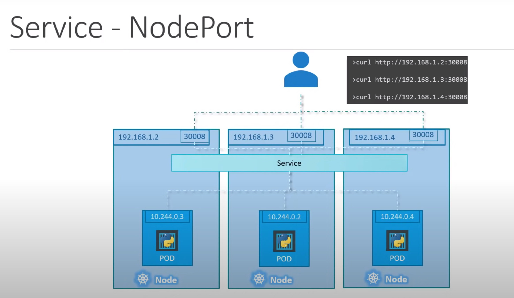

we can not access a pod from outside the pod {such as our computer}, service helps
us to communicate with these pods from outside.<br>
## Types of Services
There are three types of services:<br>
### 1. NodePort
Maps to node port to pod port. Listen to a node port and forward the request 
to a pod port. So the outsider can make request to that node port to access the pod.

The image above shows the construction of a service. But how a service will know 
the target port of belong to which pod. That is why the label and selectors are 
used. node ports are limited within range 30000-32767


If the pods are situated in multiple nodes, you don't have to do anything to access them.
The service will listen to the specific port of all the nodes and distributes them
among the pods, as long as their labels matches.



Labels of the pod is used as a selector in the service. Recomanded rules for 
[labels](https://kubernetes.io/docs/concepts/overview/working-with-objects/common-labels/)


### 2. ClusterIP
### 3. LoadBalancer

# YAML
```yaml
apiVersion: v1
kind: Service
metadata:
  name: service-name #service name can't contain uppercase letter, lowercase,-,numbers allowed
  labels:
    field1: field2
spec:
  ports:
  - port: 80
  clusterIP: None
  selector:
    pod: labels #same as the pod labels
```
